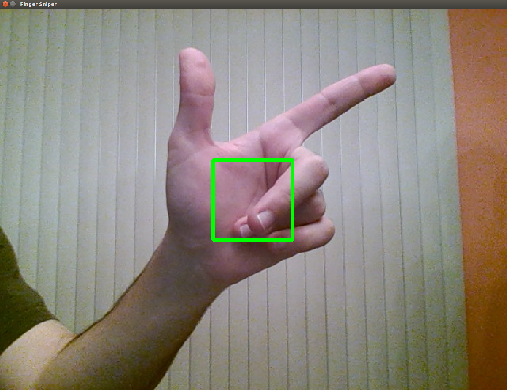
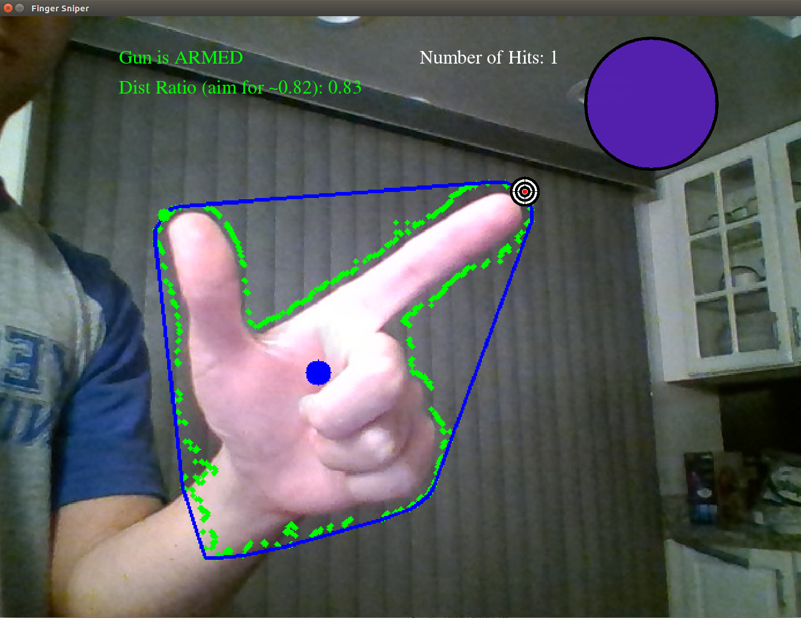

# Finger Sniper
**Team Members: Michael Wiznitzer, Solomon Wiznitzer**

Northwestern University EECS 332: Intro into Computer Vision (Fall 2017)

## Game Introduction
#### Objective
The goal of this project is to shoot the ball as many times as possible before the ball gets too small and the game terminates.

#### Info and Rules
- The ball gets smaller every time it impacts the surrounding walls of the screen. Once it gets too small, the game terminates.
- A shot is only registered once your hand goes into a shooting hand configuration. Hence, no automatic shooting can occur in this game. In order to shoot again, you must put your hand back into an open hand configuration.
- A hit is only registered if the fingertip of your index figner is on the ball when a shot occurs. If this happens, then the ball changes color and the **_Number of Hits_** message on the screen is incremented by 1.

## Game Implementation
#### Initiation and Calibration
In order to play the game, clone the repo and simply run the following command:
```bash
python fingersniper.py
```
A live video screen should pop up with a green square in the middle. Place your playing hand into the screen as shown in the image below. This is so that the game can get skin tone data so that it can detect your hand during game play. Once you place your hand in a good configuration, press `b`.


#### Playing The Game
For best results, position your hand as shown in the picture below during game play. To help you do this, a message saying **_Gun is ARMED_** will be displayed in green if your hand is in a good configuration. Otherwise, the message **_Gun is NOT ARMED_** will be displayed in red. Additionally, the ratio _Distance from centroid to thumb tip_ **divided by** _Distance from centroid to index fingertip_ will be displayed and you will want to move your hand closer or further away from the screen such that the ratio of your open hand configuration is near 0.82.

